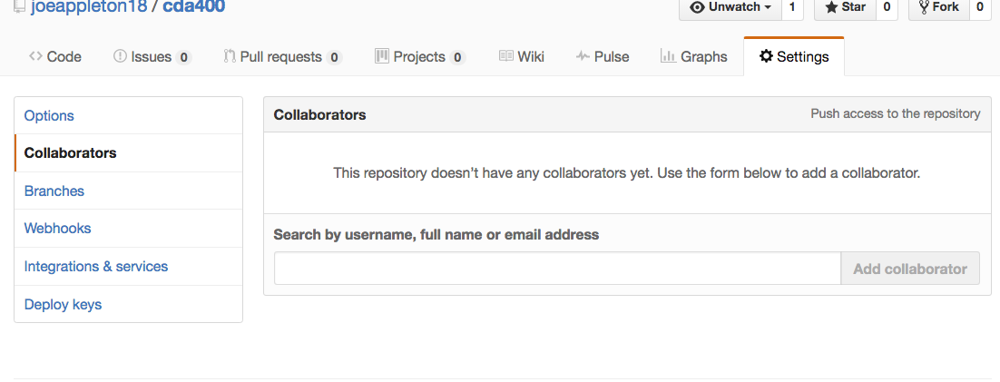
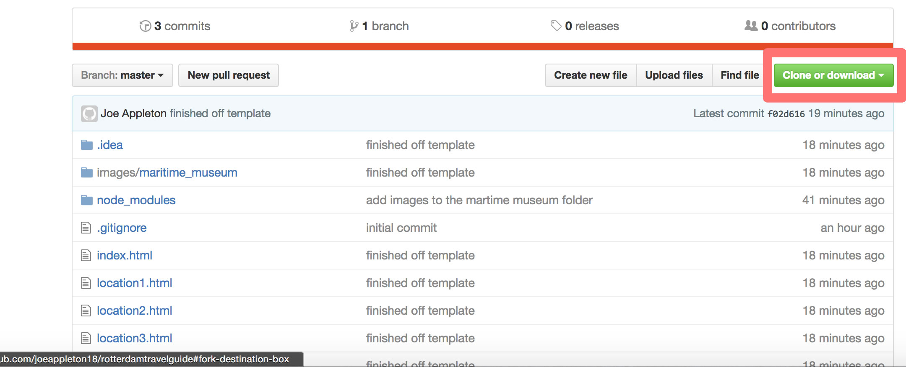

#GIT/GITHub Workflow

The purpose of this practical is to introduce you to a GIT/GITHUB workflow that we'll be using for the [assignment](http://learn.solent.ac.uk/pluginfile.php/894918/mod_resource/content/2/CDA401_Client_Side_Scripting_Assessment_1_.pdf). 


#1) Setup


##Your own computer 

- If you're using a lap to you'll need to [install git](https://sirus21.gitbooks.io/cda401/content/sessions/session5/how_to_install_git.html) 


##Cloud 9 Setup
 - Everyone should have now been emailed a [cloud9.id](https://c9.io/) invite. 
 - Create a new **private** HTML5 workspace. 
 - GIT will already be installed for you.

 
##GITHub Setup 

- If you don't already have one, set up a new [GITHUB](http://www.github.com) account. You should use your university email.
- Make sure you activate your [https://education.github.com/pack](https://education.github.com/pack). This will get you lots of free extras.


#2) Using GIT 


From within a terminal window:


###Set up your user details 

```
git config --global user.name "Your github user name"
git config --global user.email you@yourdomain.com
```

**You can check your config with**

You can check your configuration with:

``git config --list``


###Download the stater project


##Form Teams 


- Nominate a team leader **you can form one group or use smaller sub groups**. Ideally the team leader would have used git and gitHub before

- [The team leader needs to download my starter project](https://github.com/joeappleton18/rotterdamtravelguide/archive/master.zip)

- The downloaded zip file needs to be unzipped

- Next, the team leader should navigate to the decompressed folder

  - Navigate on command line to where you want to work:  (using terminal or gitBash) 

		```
		cd   <directory name>    //to change directory 
		cd    ..      //to move up one directory 
		
		```  
   	**or**
   			
   You can type `cd` then drag the folder into the terminal/gitBash window. 
   
 - Next, the team leader must create a new repository: 

 ```
    git init 
    git add -A
    git commit -m "initial commit"
 ```  

- The team leader should then create a new repository on `gitHub`. GitHub hub will provide instructions on how to add an existing project. 

- The team leader should grant access to the repository to everyone else in the team. This can be done from the repository settings  



- Everyone in the team should then clone the repository to their local computer. 

-  
>> get the repository address by pressing the clone button 

  - Type `git clone <projectadress>` and press enter 
  - A new folder called `rotterdamtravelguide` should be created containing the starter project.
  - Type `cd rotterdamtravelguide` and press enter in order to navigate into that project folder. 
  

 
 #The Task 
 
  
 - As a team pick out one attraction each to write about. This can be anything that takes their fancy. 

 - Each team member should then create a new branch, so they can work on their attraction in isolation. To create a new branch type:

 ```
   git checkout -b "branch_name"
 
 ```
 >> Note, branch names can not contain spaces.
 
 - This will create a new branch and switch to it. If you type  `git branch` you should see you are on your relevant branch 

 - Updated the html pages relating to your chosen attraction.  
 	- Commit regularly 
 	
 	```
 	  git add -A
 	  git commit -m "this is a commit message"
 	```

   - If you make a mistake:

   ```
    git reset --hard
   		
   ```
   >> resets the head to the last commit 
   
 #Pull requests 
   
 - When each team member feels they has finished their section they should push their features branch to the github origin  origin 


 ```
   git push --set-upstream origin <the name of your branch>	
```

- The team member should then locate their branch on gitHub and raise a pull request.

- If the team leader is happy with the pull request, he should merge it into the project.

- The team member should switch back to the master branch and pull the latest changes:

``` 
git checkout master
git pull origin master

```


**If we have time**

Not only is gitHub great for collaborating, they'll also host your website for free!

- Publish you website using gitHubPages 

- Create a new repository on gitHub called `<username>.github.io`
>> It must be exact, otherwise it won't work 

- Get the remote address of the new repository and assign it to a remote called website. This is what my command will look like:

-  `git remote add website  https://github.com/joeappleton18/joeappleton18.github.io.git`  


- Checkout your project master branch 

`git ceckout master`

- Ensure you have the latest change 

`git pull origin master`

- Push your work to the repository that will host your website:

`git push origin master`


- Your website can be found at `<username>.github.io`


