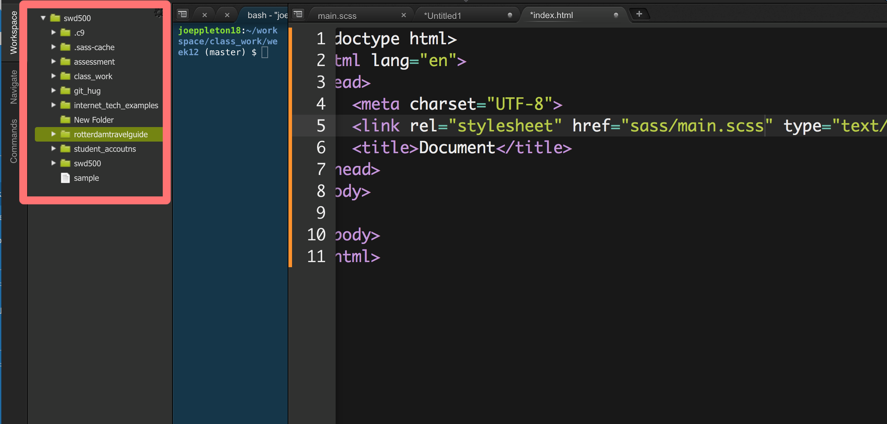

#GIT/GITHub Workflow

The purpose of this practical is to introduce you to a GIT/GITHUB workflow that we'll be using for the [assignment](http://learn.solent.ac.uk/pluginfile.php/894918/mod_resource/content/2/CDA401_Client_Side_Scripting_Assessment_1_.pdf). 


#1) Setup


##Your own computer 

- If you're using your own computer you'll need to [install git](https://sirus21.gitbooks.io/cda401/content/sessions/session5/how_to_install_git.html) 


##Cloud 9 Setup
 - Everyone should have now been emailed a [cloud9.io](https://c9.io/) invite. 
 - Create a new **private** HTML5 workspace. 
 - GIT will already be installed for you.

 
##GITHub Setup 

- If you don't already have one, set up a new [GITHUB](http://www.github.com) account. You should use your university email.
- Make sure you activate your [https://education.github.com/pack](https://education.github.com/pack). This will get you lots of free extras.


#2) Using GIT 


From within a terminal window:


###Set up your user details 

```
git config --global user.name "Your github user name"
git config --global user.email "you@yourdomain.com"
```

**You can check your config with**

You can check your configuration with:

``git config --list``


###Download the stater project

- [Download the starter project by clicking this link](https://github.com/joeappleton18/git_tut/archive/master.zip) 
- The downloaded zip file needs to be unzipped



>> Dragging files/folder into the file tree area will upload to your workspace 
 

- If you're using cloud9, upload the unzipped folder to your workspace by dragging the folder into your workspace file tree

###Initiating a git repository 

- Navigate on command line to where your work is stored
	
	```
	cd   <directory name>    //to change directory 
	cd    ..      //to move up one directory 
	
	```  
   	**or**
   	
   	- Using cloud9, right click on the file tree folder and then select open terminal

   	**or**
   			
   - Using terminal/bash you can type `cd` then drag the folder into the terminal/gitBash window
   
   
- Next create a new repository  

```
git init 
git add -A
git commit -m "initial commit"
```  
 
 - Type `git status` and check that your working directory is clean 
   
 
#The Task 

The goal of this task is to practice the workflow that you'll use for your assignment. 

As you can see, the starter project is a global travel guide, which currently only has one location. Your task is to add a new location.


   
>> TIP: In cloud 9, you can right click on any HTML file and press run. This allows you to preview the file in your browser. 
  

###Create a new branch 

Currently, you're working on the master branch. This should always contain a stable version of your work.  

Your development work should therefore be done on feature branch. Think of a new location you would like to add and then create a feature branch to allow you to develop that location


 ```
   git checkout -b "branch_name"
 
 ```
 >> Note, branch names can not contain spaces.
 

 - This will create a new branch and switch to it. If you type  `git branch` you should see you are on your relevant branch 

 
 - Updated the html pages relating to your chosen attraction.  You should add some images and grab a description off wikipedia. 
 
 	- Commit regularly 
 	
 	```
 	  git add -A
 	  git commit -m "this is a commit message"
 	```
 	
 	- Use the `git status` command to check that your working directory is clean 

   - If you make a mistake:
	
   ```
    git reset --hard
   		
   ```
   >> resets the head to the last commit 
   
- You can use the `git log` to look at your historic commits

- When you've completed your feature, `git log` to ensure the working directory is clean 
- Next, checkout your master branch and merge in your feature brnach 

```
 git checkout master 
 git merge `<the name of your feature branch >`
```

- Since your feature is now in master, you can now merge delete your feature branch. 

```
git branch -d `<the name of your feature branch>` 
```

#Storing your work on GITHUB 

- Add the end of each coding session you should push your work to a gitHub repository 

- Create a new repository on GitHub. To avoid errors, do not initialise the new repository with README, license, or gitignore files. 
  
- GitHub will then give you instruction on how to set up a remote and push your work to gitHub.   
  
  
 - Once the remote is set up, you'll be able to push your work to gitHub using `git push origin master`   
   
 
 
 - **Note,**  often you'll want to push features branches to gitHub. You can do this using:
 
 ```
   git push --set-upstream origin <the name of your branch>	
```

- Once the feature branch is set up you can omit --set-upstream


**If we have time**

Not only is gitHub great for collaborating and storing work, they'll also host your website for free!

- Publish you website using gitHubPages 

- Create a new repository on gitHub called `<username>.github.io`
>> It must be exact, otherwise it won't work 

- Get the remote address of the new repository and assign it to a remote called website. This is what my command will look like:

-  `git remote add website  https://github.com/joeappleton18/joeappleton18.github.io.git`  


- Checkout your project master branch 

`git checkout master`


- Push your work to the repository that will host your website:

`git push website master`


- Your website can be found at `<username>.github.io`


